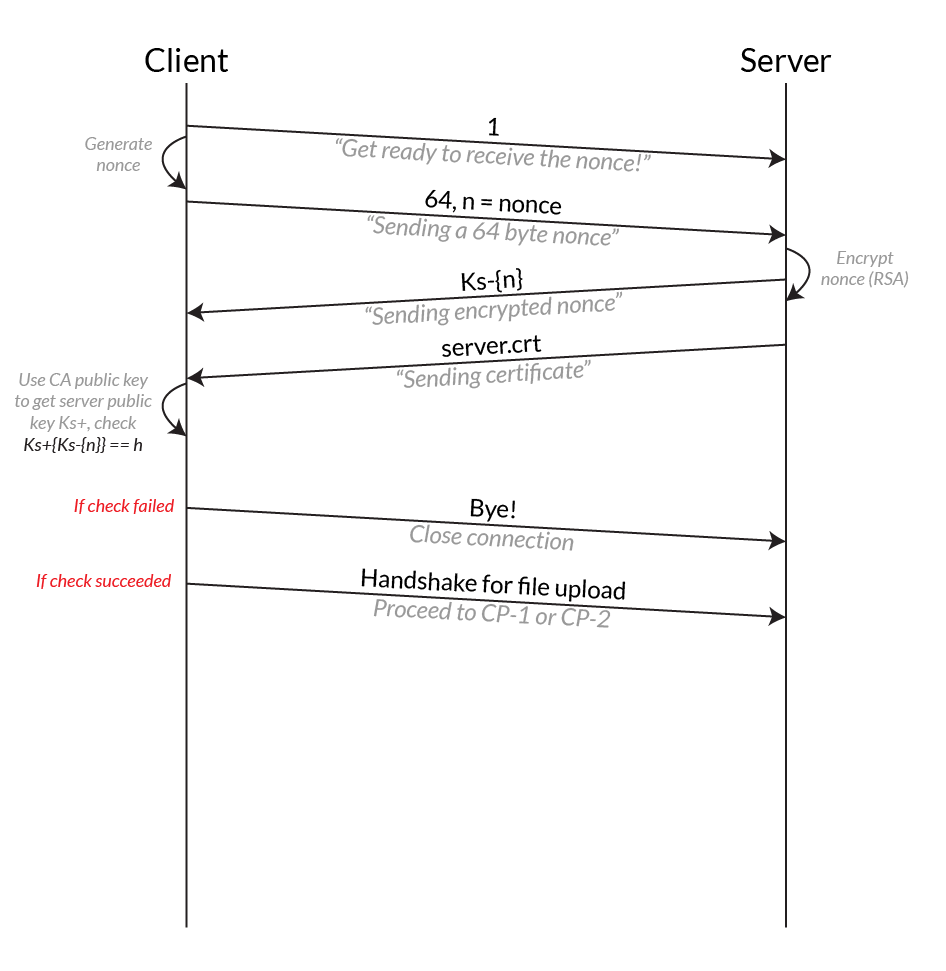
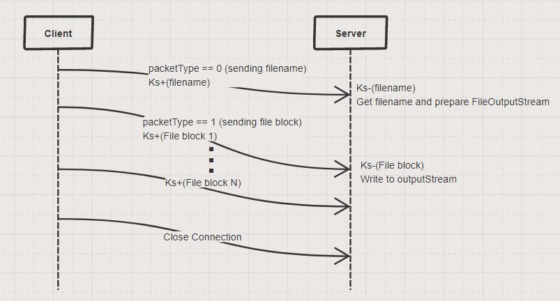

## Designing and Implementing security protocols for Computer System Design of SUTD Term5. 

Author: $Gao Yunyi, Hong Pengfei$

# 50.005 Programming Assignment 2

This application implements a secure file upload application from a client to an Internet file server with the following requirements:

1. Before the upload, the identity of the file server is authenticated using public key cryptography.
2. During the upload, the data is encrypted. We implement two encryption strategies: the first using public key cryptography (RSA), and the second that uses a session key (AES). We compare and benchmark the two strategies.

This program is written in Java and was tested in Java 8.

## Problem with Original Protocol

The issue with the original protocol is that it does not prevent a playback attack. In order to tackle this, we introduced a nonce into our system. The nonce is generated by the client and encrypted before beign sent to the server.

### AP

### CP-1

### CP-2

### Example of Successful Output

Upon a successful execution, the client will close its connection to the server and report the running time. The server will patiently await the next connection.

## Results

It is clear that the AES encryption standard is much quicker than using RSA for file transfer.

## Conclusion

We use public key authentication to perform a handshake between the client and server for file transfer. Additionally, we allow the server and client to specify the encryption policy used (public key encryption, or symmetric key encryption with AES). We benchmark the speed of both policies and conclude that symmetric key encryption is significantly faster.

